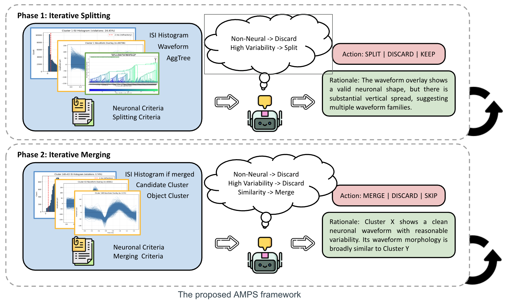

# SpikeSorting

A multimodal agent framework for iterative post-curation in spike sorting.

SpikeSorting studies whether VLM-based agents can assist or automate the expert curation process after an initial spike sorting pass. The project starts from initial clusters produced by hierarchical clustering or overclustering, then mimics how human experts inspect, split, merge, and discard clusters using waveform views, quality metrics, and iterative feedback.

The long-term goal is to build a scalable research pipeline for simulated and real extracellular recordings, supporting controlled MEArec-based benchmarking, expert-like action trajectory construction, teacher-student interaction, few-shot adaptation, memory-augmented curation, and future RL / continual learning across heterogeneous lab settings.

## Current priority — 2026-10-06

Establish a **closed-model, frozen-domain-skill autonomous curation baseline**.
Calibrate the domain instructions on development data first, then freeze the
skill, task contract, model settings, observations, controller and evaluator
before the full evaluation. SFT and open-model continual learning are later
work, not prerequisites. Renaming a prompt block to a skill does not improve
predictions by itself; changing its actual instructions may, and requires
controlled validation. An offline system/skill request builder, a candidate
skill v1 and development diagnostics are now implemented; the live runner is
unchanged, and no new model evaluation or paid run has been performed.

The completed legacy Astra/high runs scored F1 **0.3339 on CH30** and **0 on
CH31**; CH3 stopped after 84 accepted decisions and CH20 did not start. These
are retained old-protocol results, not a complete four-channel baseline or
evidence that the source MAT files are invalid. CH3/20 used a protected
controller, unlike CH30/31. Repeatedly inspected channels must not be presented
as untouched final-test data. See Section 15 of
[`项目方法与实验状态.md`](项目方法与实验状态.md) for the current protocol boundaries;
dated historical plans below do not override this priority.

## Documentation

- [Method, current protocol and consolidated results](项目方法与实验状态.md): authoritative current scope; Section 6.0 indexes prior experiments.
- [Implementation plan and offline skill v1](项目流程与实施计划_20261006.md): decisions, rule changes and remaining live-integration gates.
- [Dated research notes](spike-sorting-agent_研究笔记.md): history is preserved; only the bottom TODO list is current.
- [Failure analysis](实验失败案例分析与归档.md): evidence and limits of causal claims.
- [Script entry points](scripts/README.md): current real-data tools versus historical runners.

Detailed dated reports are in `docs/archive/`; four fixed-state reports and two
progress updates have been consolidated there. Archived recommendations are
not current instructions. Resume material remains separate from research records.

## Upstream reference

This research repository is based on JianZhi Shen's original implementation:
[jiseshen/spike-sorting-agent](https://github.com/jiseshen/spike-sorting-agent).
Use that repository when checking original source code, prompt provenance, and
historical experiment artifacts. This repository contains subsequent fixes,
audits, real-data experiments, protocol changes, and documentation, so current
behavior should not be assumed to match the upstream version exactly.

## Platform support

This project is currently supported on Linux and macOS only. Windows users should use WSL2 instead.
The main reason is that the `neuron` package does not provide a Windows wheel, so the environment is not reliable on native Windows setups.

---

## Overview



The implemented `PureVLMCurationPipeline` uses these phases:

| Phase | Operation | Current local safe route |
|---|---|---|
| 0 | Automatic spike-count filtering | Disabled when threshold = 0 |
| 1 | VLM chooses KEEP / SPLIT / DISCARD; SPLIT follows the existing hierarchy | Re-render and judge resulting clusters |
| 2 | Validate merge targets and evaluate candidate pairs | NOT_MERGE alone does not justify deleting a cluster |
| 3 | Automatic final spike-count filtering | Disabled when threshold = 0 |

The real-data safe runner disables Phase 0/3 by default; the pipeline class
and frozen historical runners retain other defaults. Always report the actual
entry point and thresholds. Historical 500/4,000/5,000 rules and deletion guards
are different controller conditions, not simply different prompts.

Existing live prompts mix task instructions, domain criteria, observation
metadata and output requirements; the main API adapter sends them as user
messages. The independent offline builder `src/agent/curation_contract.py` now
separates a fixed contract (`configs/curation/system_v1.txt`), versioned domain
skills and observations. **Live integration and model validation remain pending.**
Prompt/skill changes do not replace the Python action executor.

---

## What This Project Does

SpikeSorting currently supports two complementary settings:

1. **Real-data VLM curation**
   - Load MATLAB-based spike sorting outputs.
   - Render cluster-level diagnostic figures.
   - Run VLM agents for split / merge / discard decisions.
   - Evaluate agent decisions against curated labels or expert-derived targets.
   - Extend to Memory and online RL for adaptation to different channel settings and lab needs.

2. **Simulated benchmark pipeline**
   - Generate controlled extracellular recordings with MEArec-style simulation.
   - Produce initial overclustered states.
   - Construct canonical ground-truth curation actions.
   - Run teacher-student interaction trajectories.
   - Evaluate step-level action alignment and reasoning alignment.
   - Study adaptation across different channel settings, noise regimes, drift patterns, and lab-specific curation requirements.

---

## Current Experimental Status

The repository contains both the original real-data experiments and a completed
Stage 1-6 end-to-end run of the simulated benchmark. The counts below describe
the artifacts currently retained in `output/`; they are intended to make the
state of the research reproducible and to distinguish pipeline verification
from model-quality claims.

### Simulated Stage 1-6 run — historical, paused

The completed end-to-end run uses `setting_001`: 20 simulated 120-second
recordings, low noise (10 uV RMS), no drift, no overlap, a Neuronexus-32 probe,
MountainSort5, and the strict teacher criteria.

| Stage | Retained record | Status / interpretation |
|---|---:|---|
| 1. Simulation and overclustering | 20-channel raw archive | Raw recordings and derived arrays were generated for all channels, then compressed to `output/archives/setting_001_raw_20260820.tar.gz`; live `raw/` directories are no longer retained. |
| 2. Canonical actions | 34 valid GT actions | The corrected rebuild contains 18 `KEEP` and 16 `SPLIT` actions. The older 234-action artifact was archived after 200 non-progressing `SPLIT` actions from `ch_017` were identified as invalid. |
| 3. Teacher-student trajectories | 82 current steps across 20 channels | The corrected mock rebuild verifies state transitions and RAG data flow; one channel produced zero post-filter steps. |
| 4. Adaptation data | 12 train channels, 5 eval channels, 8 training examples | The retained `n12_seed0_qwen35` run prepared JSONL and Hugging Face data. Only non-`KEEP` mistakes are sampled, so the current eight examples are all `SPLIT`; no trained checkpoint is retained. |
| 5. Alignment | 8 channel reports | Retained aggregate: action accuracy `0.8205`, mean edit distance `0.875`, reasoning similarity `0.5`. These are mock-path diagnostics; the high action accuracy is dominated by `KEEP`, while observed `SPLIT` accuracy is zero. |
| 6. Sweep aggregation | 1 setting | The Stage 6 orchestration and aggregation completed for `setting_001`. `setting_002` and `setting_003` are configured, but a complete three-setting sweep is not currently retained. |

The simulated run therefore verifies that all six stages connect and produce
their expected artifacts. It does **not** yet establish a strong learned
student baseline: the current alignment summary comes from mock predictions,
the reasoning score is a mock-path value, and the adaptation dataset is too
small and class-imbalanced for a meaningful SFT conclusion.

### RAG integration verification — not a performance claim

Continual retrieval-augmented generation is integrated into both Phase 1
cluster decisions and Phase 2 merge decisions. The memory combines median
waveform-template similarity with numeric feature similarity (default weights
`0.7` and `0.3`) and injects the top-k past cases into the student prompt.

The retained standalone RAG verification produced:

- 84 persisted memory entries (`output/test_rag_memory_v2.jsonl`, about 4.53 MB);
- 84 trajectory steps, including per-step `rag_enabled`, `rag_hits`, and the
  retrieved examples;
- RAG hits in 19 of 20 channels (the first query starts with an empty memory);
- up to 3 retrieved examples per step with the default `top_k=3`;
- a separate three-entry real-API smoke-test memory (`output/rag_real_test.jsonl`).

This confirms the RAG storage, retrieval, prompt injection, persistence, and
trajectory-observability path. A controlled same-model `no_rag` versus `rag`
evaluation is still required before claiming an accuracy improvement. See
[`docs/archive/RAG_IMPLEMENTATION_COMPLETE.md`](docs/archive/RAG_IMPLEMENTATION_COMPLETE.md) for the
implementation record and verification command.

The later corrected Stage 3-5 mock rebuild contains 82 trajectory and memory
rows. The separate 84-row RAG artifact is retained as an earlier integration
test, not as the current canonical Stage 3 trajectory.

### Real-data inventory and provenance

The following table contains **summary statistics only**. Raw recordings,
MATLAB files, generated images, per-sample rows, model weights, and experiment
outputs are local assets and are not included in Git.

| Item | Audited count | Interpretation |
|---|---:|---|
| Current-format MAT datasets | 17 | Five inferred recording blocks; full `recording_block + channel` is the dataset ID |
| Spike events | 4,469,063 | Total across the 17 current-format MAT files |
| Labeled datasets | 16 | Have an action source and final `curation.assigns` |
| Unlabeled datasets | 1 | `cM2-e004_001-003_CH5`; inference/manual-annotation pool only |
| Replayable human edit actions | 1,374 | 636 `SPLIT`, 569 `DISCARD`, 169 `MERGE` |
| Human rationale rows | 241 | Remaining 1,133 actions have an action label but no reliable rationale |
| Regenerated diagnostic images | 5,327 | About 486 MiB locally; generated inputs, not repository assets |
| Unified action/terminal datasets | 2 | CH3 and CH31 in `cM2-e004_004-006`; replay exactly reaches the MAT terminal state |
| Separate action/terminal datasets | 14 | Valid for separate action-level and cluster-level evaluation, not a unified trajectory claim |
| Duplicate MAT files | 4 | Tianmin copies are SHA-256-identical to corresponding Jacob files and are counted once |

The original recording-block split kept channels from each inferred recording
block together. This is a historical design, not an untouched-test claim:

| Split | Inferred recording blocks | Actions | Current use |
|---|---|---:|---|
| Train | `cM2-e004_001-003`, `cM2-e004_011-015`, `cM2-e007_012-017` | 973 | Action-only SFT and train-only model selection |
| Validation | `cM2-e008_021-028` | 90 | CH30 base/SFT comparison and model selection |
| Originally designated final test | `cM2-e004_004-006` | 311 | Subsequently inspected repeatedly; not an untouched final test |

CH3/20/30/31 have been repeatedly inspected. Skill tuning on them is development
work; audit exposure of other recordings before assigning a new held-out role.

Recording/session identity is inferred from directory names and has not yet
been confirmed by the provider. This split is safer than random channel/sample
splitting but must still be reported as provisional. The action labels come
from ordered Excel sheets or `spikes.curation.action(s)` inside MAT files;
terminal cluster labels come from `spikes.curation.assigns`. Provenance and
SHA-256 hashes are recorded by the local manifest pipeline.

Repository data policy:

| Local asset | Typical local location | Git policy |
|---|---|---|
| Raw/current-format MAT data | `data/`, `Tianmin_Annotated_data/`, `Jacob Bedke-.../` | Ignored; never commit |
| Per-sample JSONL and 5,327 PNG inputs | `output/real_manifest_action_dataset_*/` | Ignored; regenerate locally |
| Rollout predictions and reports | `output/` | Ignored; only aggregate numbers/methodology are documented |
| LoRA/model weights and caches | `checkpoints/`, `models/`, `wandb/` | Ignored; distribute separately if authorized |
| API credentials | `.env` | Ignored; `.env.example` may contain names only, never secrets |

At the current commit boundary, Git tracks no MAT/NPY/NPZ/JSONL/CSV/Excel,
model-weight, or per-run output files. Three tracked PNG files under `figures/`
are documentation figures, not source recordings or per-sample model inputs.

### Historical real-data artifacts

The retained legacy MATLAB experiments cover CH3, CH20, CH30, and CH31. The
table below is a re-evaluation of the saved terminal assignments with the
current metric implementation where possible. These are **historical
artifacts**, not a stable current baseline.

| Method | Mean precision | Mean recall | Mean F1 |
|---|---:|---:|---:|
| Before curation | 0.2247 | 0.8855 | 0.3536 |
| VLM + heuristic baseline | 0.2327 | 1.0000 | 0.3712 |
| Retained GPT-4.1 terminal assignments | 0.5479 | 0.8606 | 0.5861 |
| Retained GPT-5.1 terminal assignments | 0.7735 | 0.8327 | 0.7718 |
| Retained GPT-5.1 no-metrics assignments | 0.6315 | 0.8244 | 0.6624 |
| Human-curated reference target | 1.0000 | 1.0000 | 1.0000 |

The older README aggregate reported GPT-5.1 as
`P/R/F1=0.7653/0.8327/0.7671`; the current-artifact re-evaluation is
`0.7735/0.8327/0.7718`. The discrepancy comes from the retained CH31
false-positive count. Neither number is a new model run. The exact historical
source revision and random waveform subsets are unavailable, and the legacy
controller used uncalibrated `<500` and `<5,000` spike-count filters. Therefore
the apparent no-metrics difference is observational legacy evidence, not a
controlled image-versus-numeric ablation or proof of numeric-feature benefit.

### Current CH30 fixed-state action evaluation

The current action-level benchmark contains 90 logged human edits from the
provided CH30 Excel action sheet: 41 `DISCARD`, 43 `SPLIT`, and 6 `MERGE`.
Each prediction uses the correct human pre-action state and is scored without
being executed. The log contains no human `KEEP` or `NOT_MERGE` labels, so this
is an **expert edit-action imitation** benchmark, not a complete curation-policy
benchmark. The repository does not identify the individual human annotator.
The CH30 Excel trajectory and MAT terminal assignment are marked
`separate_action_and_terminal`, so they must not be presented as one unified
ground-truth curation pass.

| Model | Action accuracy | Macro-F1 | DISCARD recall |
|---|---:|---:|---:|
| Qwen3.5-2B base | 0.067 | 0.333 | 0.000 |
| Qwen3.5-4B base | 0.378 | 0.530 | 0.024 |
| Qwen3.5-9B base | 0.500 | 0.570 | 0.000 |
| Gemma-4-E4B-it base | 0.544 | 0.578 | 0.000 |
| GPT-4.1 API | 35/90 = 0.389 | 0.575 | 0/41 = 0.000 |
| GPT-5.1 API | 33/90 = 0.367 | 0.564 | 0/41 = 0.000 |
| Numeric-only Random Forest | 84/90 = 0.933 | 0.952 | 0.854 |

All VLM rows use the same 90 fixed states and strict action-only outputs. The
supervised Random Forest was trained on 831 split-stage actions from three
non-overlapping recording blocks, so its advantage over zero-shot VLMs does
not establish that images are unnecessary. A fair image-value test still
requires supervised numeric-only, images-only, and combined models trained on
the same blocks. The six `MERGE` labels are positive-only; no current result
demonstrates rejection of an incorrect merge.

### GPT-5.1 cautious-source full rollout (2026-09-23)

All four channels were rerun from their initial assignments with JianZhi's
shared cautious source prompt, exact model snapshot `gpt-5.1-2025-11-13`,
reasoning effort `medium`, and no total call cap. This is the skill-rich
zero-shot expert harness; actions were executed and changed later states.

| Channel | API calls | Final units | Precision | Recall | F1 | Exact historical assignment |
|---|---:|---:|---:|---:|---:|---:|
| CH3 | 14 | 0 | 0.0000 | 0.0000 | 0.0000 | No |
| CH20 | 3 | 0 | 0.0000 | 0.0000 | 0.0000 | No |
| CH30 | 27 | 1 | 0.9878 | 0.5578 | 0.7130 | No |
| CH31 | 24 | 2 | 0.6797 | 0.7728 | 0.7233 | No |
| **Mean** | **68 total** | — | **0.4169** | **0.3327** | **0.3591** | **0/4** |

The run used 174,606 tokens, with an estimated API cost of $0.4861 at the
documented GPT-5.1 token rates. CH3 and CH20 ended empty; CH30 and CH31 reached
scores close to the retained historical endpoints but not identical spike
assignments. The old visualization path uses an unseeded random 5,000-waveform
sample, and a closed-loop action divergence changes all later states. This
single run therefore demonstrates protocol instability, not a stable estimate
of GPT-5.1 capability. See
[`docs/archive/GPT51_CAUTIOUS_FULL_ROLLOUT_20260923.md`](docs/archive/GPT51_CAUTIOUS_FULL_ROLLOUT_20260923.md).

### GPT-5.1 deletion-protected full rollout (2026-09-23)

The same four channels were then rerun with the cautious prompt unchanged but
with destructive controller behavior made recoverable: automatic `<500` and
`<5,000` filters were disabled, Phase-1 `DISCARD` on clusters with at least
4,000 spikes became `SPLIT`/`ABSTAIN`, and Phase-2 `DISCARD` became
`ABSTAIN`. This tests a safety intervention, not a new prompt or trained model.

| Channel | API calls | Final units | Assigned spikes | Precision | Recall | F1 |
|---|---:|---:|---:|---:|---:|---:|
| CH3 | 258 | 55 | 82,700 | 0.2221 | 1.0000 | 0.3634 |
| CH20 | 207 | 38 | 70,354 | 0.2625 | 1.0000 | 0.4158 |
| CH30 | 869 | 50 | 376,317 | 0.2116 | 0.8742 | 0.3408 |
| CH31 | 213 | 31 | 120,026 | 0.4194 | 1.0000 | 0.5909 |
| **Mean / total** | **1,547 total** | — | **649,397** | **0.2789** | **0.9686** | **0.4277** |

The run used 3,780,384 tokens and an estimated $11.85 under the documented
rate assumptions. It prevented the CH3/CH20 empty-output failure, but excessive
preservation caused 482,591 pooled false-positive spikes and low precision.
The model also gave contradictory validity judgments for the same small
cluster when only the candidate merge target changed. Deletion protection is
therefore retained as a safety fail-safe, not accepted as a performance
solution. Detailed protocol and analysis are in
[`docs/archive/GPT51_DELETE_PROTECTED_FULL_ROLLOUT_20260923.md`](docs/archive/GPT51_DELETE_PROTECTED_FULL_ROLLOUT_20260923.md).

### Invalid cross-channel strict-prompt run (retained for audit)

GPT-5.1 was rerun from each channel's initial assignments with a strict prompt
recovered from the retained CH30 artifacts. Subsequent forensic comparison
showed that this was **not** the shared prompt checked into JianZhi's source and
used by the call-suffixed CH3/CH20/CH31 artifacts. It was therefore a
cross-channel strict-prompt stress test, not a faithful four-channel
reproduction. There was no total API-call cap; actions were executed and
changed subsequent states.

| Channel | API calls | Final units | Precision | Recall | F1 | Exact historical assignment |
|---|---:|---:|---:|---:|---:|---:|
| CH3 | 9 | 0 | 0.0000 | 0.0000 | 0.0000 | No |
| CH20 | 7 | 0 | 0.0000 | 0.0000 | 0.0000 | No |
| CH30 | 21 | 1 | 1.0000 | 0.5578 | 0.7162 | Yes |
| CH31 | 58 | 2 | 0.7955 | 0.9173 | 0.8521 | No |
| **Mean** | **95 total** | — | **0.4489** | **0.3688** | **0.3921** | **1/4** |

The numbers above describe that strict-prompt run only. They cannot be used to
claim that JianZhi's historical four-channel policy failed reproduction,
because CH3, CH20, and the final call-suffixed CH31 run used the more cautious
shared source prompt. CH30 remains a valid reproduction attempt for its own
retained strict-prompt artifacts: it reached the same endpoint through a
different trajectory. Neither historical nor fresh legacy numbers are a SOTA
claim or the current project baseline. Full details and the correction are in
[`docs/archive/LEGACY_FULL_ROLLOUT_ALL_CHANNELS_20260922.md`](docs/archive/LEGACY_FULL_ROLLOUT_ALL_CHANNELS_20260922.md).

The human reference is a target derived from the provided curation data, not
an independent blind human benchmark. The large source MAT directories and API
credentials are local-only and are not version-controlled.

### Safe real-data student path

Real datasets are identified by the complete recording-block/channel id (for
example, `cM2-e004_004-006_CH3`), not by `CH3` alone. The manifest batch runner
excludes unlabeled CH5 by default and writes one resumable directory per
dataset. The current real-data defaults also disable the uncalibrated Phase 0
and Phase 3 spike-count filters. Provider failures never fall back silently to
mock decisions, parse failures return `ABSTAIN`, and `NOT_MERGE` preserves a
distinct cluster rather than discarding it.

Training and runtime now share the same Phase 1 observation contract: waveform
overlay, ISI histogram, amplitude distribution, aggregation tree, and numeric
ISI/amplitude metrics. Formal fixed-state evaluation now uses the versioned
`action-only-json-v2` contract: exactly one JSON `action` field, no rationale,
and a strict response schema. Legacy reasoned output remains available only as
an explicit compatibility mode. The leakage-aware split uses three recording
blocks for training, `cM2-e008_021-028`/CH30 for validation, and
`cM2-e004_004-006` originally designated as the final-test block. Subsequent
CH3/20/31 experiments and failure analysis mean that this block can no longer
be described as untouched. The previously planned action-only Qwen3.5-9B
LoRA/SFT comparison remains future student work; the immediate priority is
the closed-model frozen-skill baseline described above. The student path's
four-view/action-only contract is distinct from the legacy closed-model
three-view/action-plus-rationale protocol; changing that contract requires
an explicitly versioned experiment.

The complete 2026-09-14 run record, data limitations, and open-model roadmap are
documented in [`docs/archive/REAL_DATA_OPEN_VLM_STATUS_20260914.md`](docs/archive/REAL_DATA_OPEN_VLM_STATUS_20260914.md).
The current method definition, evaluation terminology, legacy/current result
boundary, and paper-oriented experiment plan are consolidated in
[`项目方法与实验状态.md`](项目方法与实验状态.md).

---

## Repository Structure

```text
src/
  io/                 # Load MATLAB / MEArec data
  cluster/            # Cluster state management and split / merge operations
  agent/              # VLM API calls, prompts, runners, and teacher feedback
  eval/               # Metrics and evaluation utilities
  pipeline/           # Existing end-to-end pipeline utilities
  ablation/           # Ablation and comparison code

  simulate/           # Stage 1: MEArec generation and overclustering
  actions/            # Stage 2: Canonical GT action trajectory construction
  trajectories/       # Stage 3: Teacher-student interaction trajectories
  adapt/              # Stage 4: Few-shot / SFT adaptation
  alignment/          # Stage 5: Step-level action and reasoning alignment
  scale/              # Stage 6: Multi-setting sweep and aggregation

scripts/
  run/                # Existing run scripts
  finetune/           # Finetuning baselines
  aggregate/          # Result aggregation
  analysis/           # Analysis utilities
  plot/               # Plotting scripts
  demo/               # Demo scripts
  test/               # Unit-style evaluation scripts
```
